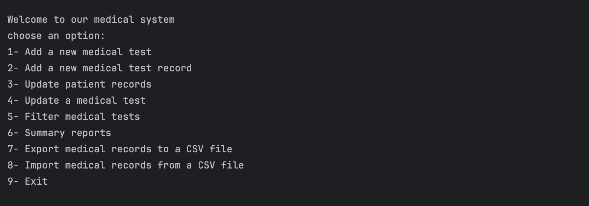

# Medical System Data Organizer  

The **Medical System Data Organizer** is a Python-based system for managing **medical test records** and **patient data** efficiently. It allows users to add, update, filter, and export/import medical records, making it a useful tool for healthcare data management.  

## **Features**  

✔ **Add a New Medical Test** – Create and store new medical test types in the system.  
✔ **Add a New Medical Test Record** – Assign a test to a patient and store the results.  
✔ **Update Patient Records** – Modify existing patient information or test records.  
✔ **Update a Medical Test** – Edit details about an existing medical test.  
✔ **Filter Medical Tests** – Search and filter medical tests based on criteria.  
✔ **Generate Summary Reports** – Create reports summarizing medical test results.  
✔ **Export Medical Records to CSV** – Save all medical test data to a CSV file for external use.  
✔ **Import Medical Records from CSV** – Load existing medical test records from a CSV file.  

## Example Usage

To run the program, provide the input files attached and Run the main.py file :

 

## Contact

For any inquiries, reach out via:

- Email: [miar.taweel04@gmail.com](mailto\:miar.taweel04@gmail.com)
- GitHub: [miarTaweel](https://github.com/miarTaweel)
